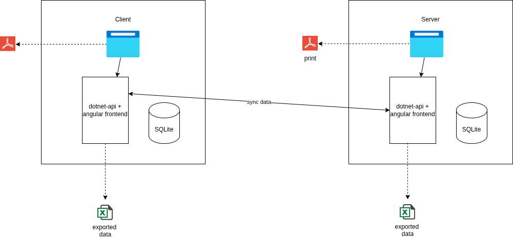

# region-orebro-lan KLIRR hackathon projekt

## Information

Vi har bestämt oss för att bygga en tjänst som dels tillhandahåller viktig information för kontakt inom organisationen och dels en lösning för att kunna göra beställningar av förbrukningsvaror för vården. Anledning till valet av applikation är att det kommit önskemål om det inom vår organisation.

## Arkitektur

Systemet kommer bestå av en klientdel, som kommer köras på varje dator, och en serverdel, som kommer köras som en central del. Tanken med projektet är att klienterna ska kunna fungera oavsett om servern är online eller inte, med andra ord ett offline-first mönster.

Synkronisering av data kommer mellan klient och server kommer att ske kontinuerligt. I de fall där servern tillfälligt inte kan kontaktas så kommer klienten hålla  informationen lokalt och göra nya försök till synkronisering senare.

Rent tekniskt så är klient- och server-mjukvaran samma applikation, det som skiljer är konfiguration. En klient kan alltså konfigureras om till att agera som en ny server i runtime i de fall den "riktiga" servern blivit oåtkomlig.

### Klient

Klienterna kommer att synka ner data från servern kontinuerligt och kunna lägga beställningar som också synkas när servern är online. För att fungera när servern är offline skrivs alla beställningar lokalt först och går att granska och printa lokalt i klienten. Orderstatus syns på varje beställning för att indikera om den skickats till servern eller inte.  
Klienterna tillhandahåller också information om kontaktvägar i organisationen för att fungera som en informationskälla när övriga tjänster och kommunikationsvägar är nere.  

### Server

Servern består av ett admin-gränssnitt och ett api som tar emot beställningar och kan leverera information om verksamhetsens kommunikationsvägar. Tanken är sedan att man ska kunna koppla på mikrotjänster som läser ut beställningar och integrerar mot leverantörer.

### Saker vi tänkt på men inte som vi insåg vi inte riktigt skulle hinna med
* Peer to peer lösning där klienter på samma nät kan dela med sig information om en server varit oåtkommlig under en lång tid
* Autentisering och auktorisering
* Vettig deploy
* "Analog" delning av data. Alltså exportera data till extern media för att importera till olika klienter.
